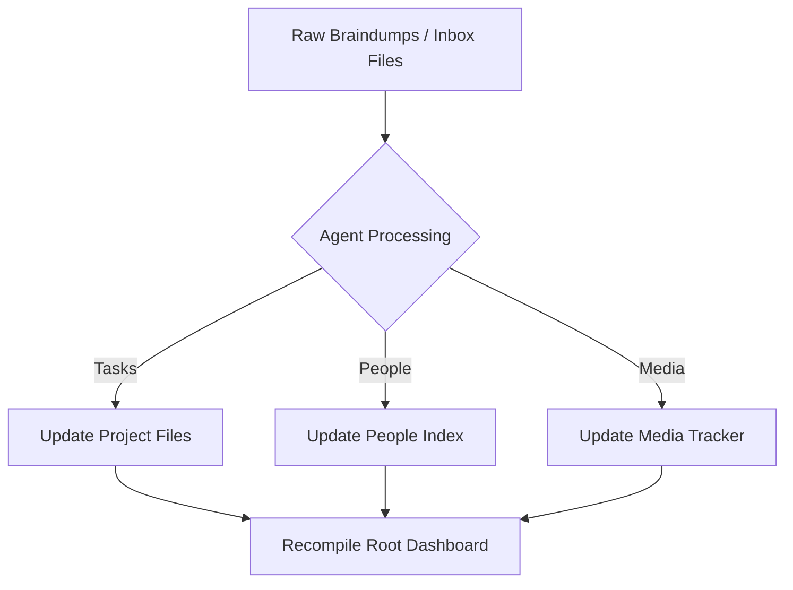

# Inbox Synthesis Protocol

## Purpose
To regularly process raw inputs, email summaries, chat logs, and braindumps, and compile them into structured project tasks, people touchpoints, and dashboard items.

---

## Frequency
* **Daily (Quick scan):** Process raw text files in [00_inbox/](file:///c:/Users/Bosho/Desktop/Bosho%20OS/00_inbox/) and clear them.
* **Weekly (Weekly Review):** Synthesize external sources (emails, calendar meetings, drive documents, and Linear/Todoist tasks) and update the main [00_dashboard.md](file:///c:/Users/Bosho/Desktop/Bosho%20OS/00_dashboard.md).

---

## Step-by-Step Synthesis Workflow

### Step 1: Collect Inputs
1. Locate any new `.md` files or text dumps in [00_inbox/](file:///c:/Users/Bosho/Desktop/Bosho%20OS/00_inbox/).
2. Consolidate notes from emails, external notebooks, or voice transcripts.

### Step 2: Categorise & Distribute
Use the [braindump_processing_template.md](file:///c:/Users/Bosho/Desktop/Bosho%20OS/09_templates/braindump_processing_template.md) to separate themes:
* **Tasks & Project Updates:** Go to the respective file in [02_projects/](file:///c:/Users/Bosho/Desktop/Bosho%20OS/02_projects/).
* **Relationship updates:** Go to [people_index.md](file:///c:/Users/Bosho/Desktop/Bosho%20OS/05_people_network/people_index.md).
* **Media & learning logs:** Go to [recreation_media_tracker.md](file:///c:/Users/Bosho/Desktop/Bosho%20OS/06_health_recovery/recreation_media_tracker.md).
* **Calendar items:** Schedule in google calendar or add to weekly work blocks in [08_weekly_plans/](file:///c:/Users/Bosho/Desktop/Bosho%20OS/08_weekly_plans/).

### Step 3: Rebuild the central Dashboard
1. Scan all active project files in [02_projects/](file:///c:/Users/Bosho/Desktop/Bosho%20OS/02_projects/) for incomplete tasks.
2. Update the "Milestones & Active Tasks" section on the [00_dashboard.md](file:///c:/Users/Bosho/Desktop/Bosho%20OS/00_dashboard.md).
3. Ensure any tasks flagged as **Next Item** are placed at the top of the dashboard.
4. Archive the processed raw file in `00_inbox/` by moving it to an `00_inbox/archive/` folder or renaming it with an `_processed` suffix.
