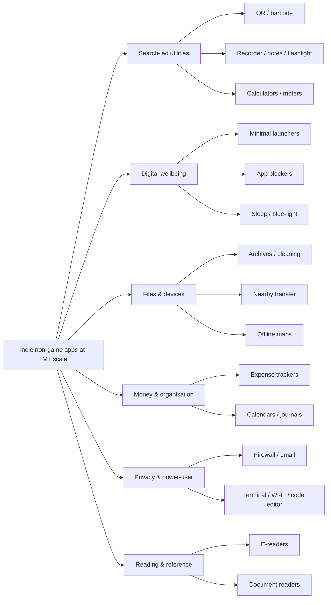
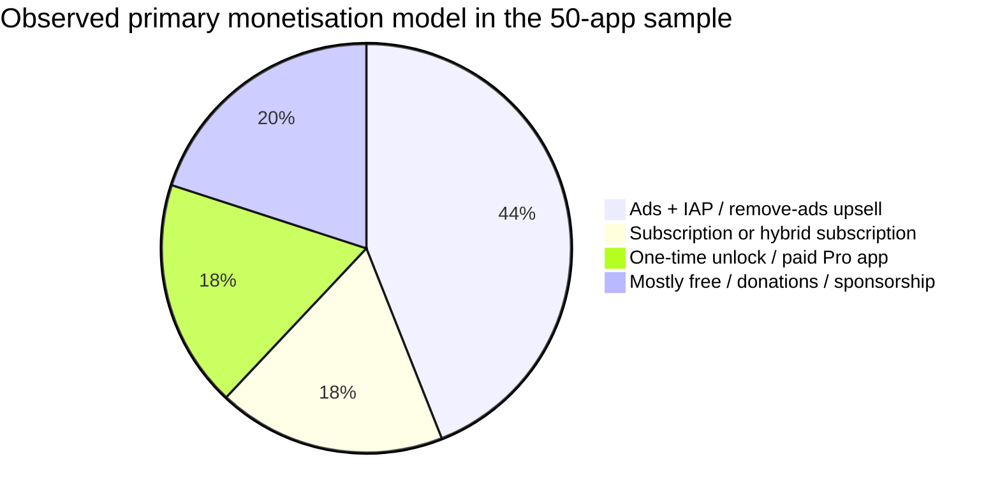
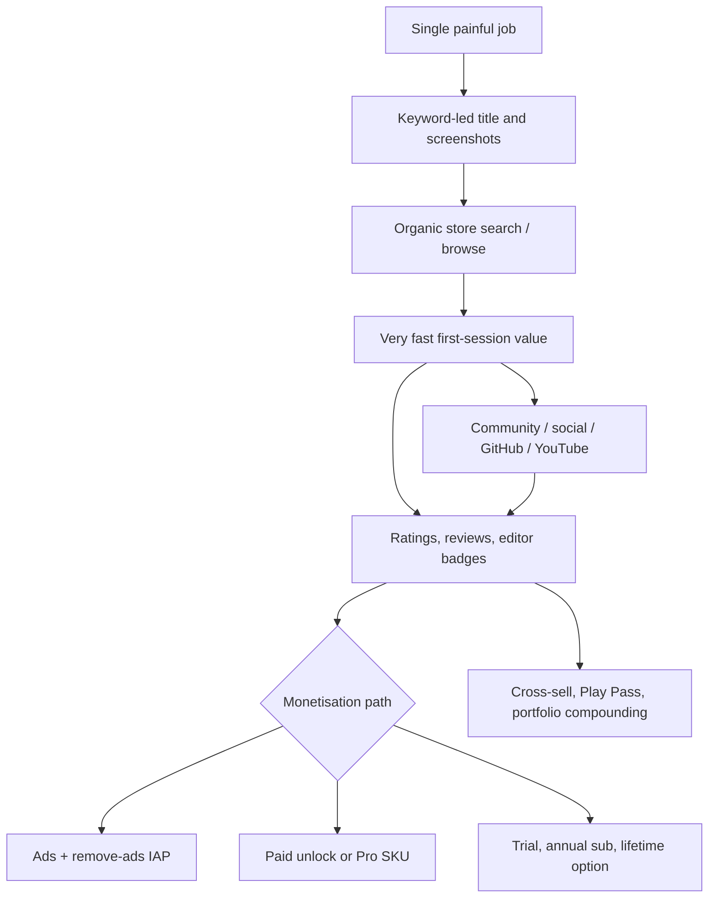

# Indie Mobile App Market Deep Dive

## Executive summary

The current non-game indie mobile market is dominated less by “novel” ideas than by **painfully clear, high-intent jobs**: scanning a code, blocking distractions, logging expenses, reading files, cleaning storage, replacing the launcher, or tracking sleep. The strongest examples are not broad social products; they are *single-purpose utilities and focused personal tools* with obvious search terms and fast time-to-value. At the portfolio level, TeaCapps reports about **400 million downloads across three apps**, Splend Apps reports **500 million total installs**, Cleveni says its utility portfolio serves **200 million+ users**, Realbyte’s Money Manager claims **20 million+ downloads**, Niagara Launcher is at about **15 million downloads**, LocalSend’s Play listing says **8 million+ downloads**, and Sleep as Android’s official growth story says it has helped **18 million people** over its lifetime. citeturn35search6turn16search8turn18search11turn16search3turn30search1turn15search2turn41search8

Two monetisation patterns are repeatedly working. **Mass utilities** typically use ads plus in-app purchases or a paid “Pro” companion SKU, because the install volumes are large and the jobs are generic. **Higher-intensity, habit-forming apps** such as digital wellbeing launchers, sleep tools, blockers, and some premium productivity apps more often use subscriptions, yearly plans, or a lifetime unlock. RevenueCat’s 2026 subscription benchmark shows a **10.7% median hard-paywall conversion**, versus a much lower **0.3%–8.2% freemium range**, while Adapty’s 2026 productivity benchmark puts **install-to-trial at 9.8%** and **trial-to-paid at 29.5%**. citeturn13search0turn13search3turn13search8

Growth is still overwhelmingly organic for many indies. AppsFlyer’s 2026 monetisation report says **70% of non-gaming subscription revenue is organic globally**, which matches what this dataset shows: search-intent titles, App Store/Play placement, editorial badges, YouTube/TikTok-style explainer content, GitHub/community distribution, and portfolio compounding are more common than heavy paid UA. AppTweak’s case-study library is not indie-specific, but it underlines the same point: ASO remains a material lever, with one highlighted example posting **88% growth in organic downloads** after ASO work. citeturn13search1turn13search2

The most attractive part of this market for a solo developer or small team is that **“boring” still scales** when the problem is urgent, repetitive, and easy to describe in the title itself. The highest-confidence opportunities in 2026 are: digital-minimalism launchers, app blockers, finance trackers, QR/document capture, reading/document utilities, privacy-first tools, and specialist creator/dev utilities. The common playbook is a focused wedge, a brutally clear listing, very short onboarding, and a pricing system that matches user intensity rather than app complexity. citeturn29search0turn30search1turn20view0turn35search9turn32search6turn24search0turn28search0

## Scope and method

This report filters for **non-game** mobile apps created by **solo developers, founder-led studios, open-source communities, or clearly independent small teams**. I excluded obvious big-tech products, venture-heavy category leaders, and games. Where small-team status is public, I note it directly; where headcount is private, I use cautious labels such as “solo”, “OSS community”, or “small studio, exact size unspecified”.

Because Apple does not publish install counts publicly, the **download column uses Google Play install bands as the floor**, and then upgrades to a more precise public estimate when I found one on an official site or a reputable directory. In the table, **“3p est.”** means a third-party public estimate or directory-assisted figure rather than a first-party Play band.

Your brief referenced **three Google Play developer pages**, but those URLs were not visible in the chat context I could access, so I could not explicitly tag them as such. I therefore built the dataset from directly verifiable public app pages, developer pages, official sites, interviews, and benchmark reports.

## Export-ready dataset

The table below is intentionally compact so it can be copied into a spreadsheet. “Revenue signal” is conservative: I only use explicit prices, paid-SKU install counts, portfolio totals, editorial badges, or leave it as unspecified.

| App | Developer / studio | Platform(s) | Estimated downloads | Release year | Team size | Primary niche | Problem solved | Primary monetisation | Revenue signal / benchmark | Sources |
|---|---|---:|---:|---:|---|---|---|---|---|---|
| QR & Barcode Scanner | TeaCapps | Android / iOS | 100M+ (3p est.) | Unspecified | ~10–19 est. | QR / barcode utility | Scan codes and product barcodes fast | Ads + IAP + paid Pro app | TeaCapps portfolio at ~400M downloads across 3 apps | citeturn35search9turn16search1turn16search17 |
| QRbot: QR & barcode reader | TeaCapps | Android / iOS | 5M+ | Unspecified | ~10–19 est. | QR / barcode utility | Scan, create and manage QR codes | Ads + IAP | Same 3-app, 400M-download studio | citeturn35search1turn35search7turn16search17 |
| Open Camera | Mark Harman | Android | 100M+ | Unspecified | Solo | Camera replacement | Better manual camera controls than stock camera | Mostly free; developer states no third-party in-app ads | Mass-scale free OSS utility; revenue unspecified | citeturn22view0turn21search15 |
| Background Eraser | handyCloset Inc. | Android / iOS | 100M+ | Unspecified | Small studio, exact size unspecified | Photo editing | Remove backgrounds for cut-outs and stickers | Ads | High-volume photo micro-tool | citeturn21search1turn16search10turn16search14 |
| PhotoLayers-Superimpose,Eraser | handyCloset Inc. | Android / iOS | 10M+ | Unspecified | Small studio, exact size unspecified | Photo compositing | Layer images and make simple composites | Ads | Companion tool to a 100M+ portfolio hit | citeturn21search2turn16search10turn16search14 |
| ZArchiver | ZDevs | Android | 100M+ | Unspecified | Solo | File / archive tool | Open, create and manage archives on-device | Free + donor app | Separate Donate SKU exists | citeturn23view0 |
| Sleep as Android | Petr Nálevka / Urbandroid | Android | 10M+ Play; 18M lifetime helps | 2010 | ~5 | Sleep tracker / alarm | Smart wake-up, sleep tracking, snore analysis | Freemium + IAP / premium upgrade | Official growth story says 1M+ active users; paid unlock companion also 1M+ | citeturn41search4turn41search8turn41search0 |
| Sleep as Android Unlock | Petr Nálevka / Urbandroid | Android | 1M+ paid installs | Unspecified | ~5 | Premium unlock | Permanent premium access for core sleep app | One-time paid unlock | Very strong paid-SKU revenue signal | citeturn40search7turn41search0 |
| Twilight: Blue light filter | Petr Nálevka / Urbandroid | Android | 10M+ | 2013 | ~5 | Eye-strain / sleep aid | Reduce blue light at night | Freemium + Pro unlock | Pro unlock listed separately; strong evergreen use case | citeturn11search13turn11search9turn41search0 |
| DigiCal Calendar Agenda | Digibites | Android | 10M+ | Unspecified | Small independent studio | Calendar / agenda | Better planning and calendar visibility | Ads + IAP | Strong evergreen utility; 10M+ scale | citeturn40search2turn40search1 |
| SD Maid 2/SE | darken | Android | 1M+ | 2023 | Solo / very small | System cleaner | Remove leftovers, duplicates and storage junk | IAP | Focused power-user cleaner | citeturn40search0turn40search8 |
| Niagara Launcher | Mellowdrop Studio | Android | 15M | 2021 | Small indie team | Minimal launcher | Reduce clutter and speed up app access | Subscription + lifetime; no ads | AppBrain ranks it highly; subscription funds full-time indie team | citeturn30search1turn14search12turn14search8 |
| Smart Launcher 6 | Smart Launcher Team | Android | 50M+ Play; 53M AppBrain | 2012 | Independent ~50 remote team | Smart launcher | Auto-categorised home screen and search | IAP | Independent and unfunded, but upper-end “indie” by size | citeturn31search12turn17search6turn31search11 |
| minimalist phone® Screen Time | QQ42 Labs | Android / iOS | 5M+ Play; 7M+ Android users | Unspecified | Small team, exact size unspecified | Digital detox launcher | Lower screen time and block distractions | Subscription + lifetime | iOS shows monthly, annual and lifetime pricing | citeturn29search0turn31search13turn31search2 |
| Olauncher. Minimal AF Launcher | Digital Minimalism | Android | 1M+ Play; 2.4M est. | Unspecified | Solo / very small | Minimal launcher | Extremely spare launcher to reduce phone use | Free / donation-style; ad-free | High-scale low-monetisation OSS-style example | citeturn17search4turn30search5 |
| To Do List | Splend Apps | Android | 10M+ | Unspecified | Founder-led studio; exact size unspecified | Task lists | Simple to-do management and reminders | Ads + IAP + Play Pass | Splend says 500M total installs portfolio-wide | citeturn37view0turn16search8 |
| Voice Recorder | Splend Apps | Android | 10M+ | Unspecified | Founder-led studio; exact size unspecified | Recording | Easy lectures, interviews, voice notes | Ads + IAP + Play Pass | Same 500M-install portfolio compounding effect | citeturn37view1turn16search8 |
| Notepad - Notes and Tasks | Splend Apps | Android | 5M+ | Unspecified | Founder-led studio; exact size unspecified | Notes | Notes, reminders, shopping lists, memo capture | Ads + IAP + Play Pass | Same studio scale signal | citeturn38view0turn16search8 |
| File Manager | Splend Apps | Android | 1M+ | Unspecified | Founder-led studio; exact size unspecified | File explorer | Browse and manage files simply | Ads + IAP + Play Pass | Same studio scale signal | citeturn37view3turn16search8 |
| Sound Decibel Meter | Splend Apps | Android | 10M+ | Unspecified | Founder-led studio; exact size unspecified | Niche sensor utility | Measure sound levels | Ads + IAP | Shows strength of hyper-specific utility tools | citeturn39search0turn16search8 |
| Flashlight | Splend Apps | Android | 100M+ (3p est.) | Unspecified | Founder-led studio; exact size unspecified | Core utility | Turn phone into reliable torch | Ads + IAP | Huge generic-intent utility volume | citeturn39search15turn16search8 |
| BMI Calculator | Splend Apps | Android | 5M+ (3p est.) | Unspecified | Founder-led studio; exact size unspecified | Micro-health calculator | Quick BMI checks and weight goals | Ads + IAP | Good example of calculator-like health niche | citeturn39search11turn16search8 |
| Screenshot | Splend Apps | Android | 10M+ (3p est.) | Unspecified | Founder-led studio; exact size unspecified | Device utility | Easier screenshot workflows | Ads + IAP | Another keyword-led, single-job utility | citeturn36search11turn16search8 |
| Money Manager Expense & Budget | Realbyte | Android / iOS | 20M+ | 2012 | Small company, exact size unspecified | Personal finance | Record spending, assets and reports | Freemium + IAP / upgrade | Official site claims 20M+ and Editors’ Choice | citeturn16search3turn18search1 |
| Bluecoins Finance & Budget | Mabuhay Software | Android | 1M+ | Unspecified | Solo | Personal finance | More advanced budgeting, reports and sync | Ads + IAP + lifetime premium | Play page advertises lifetime premium sale; Editor’s Choice 2018 | citeturn20view0turn18search0 |
| Wallet: Budget Expense Tracker | BudgetBakers | Android | 10M+ | Unspecified | 3-app studio; exact size unspecified | Personal finance | Budgeting, card tracking, forecasts | Freemium + subscription / IAP | Top 100 in 10+ countries per AppBrain | citeturn18search2turn18search4 |
| 1Money: expense tracker budget | Esin Dmitrii | Android | 6M | ~2017 | Solo | Personal finance | Fast manual expense tracking | Freemium + IAP | Top-100 finance rankings | citeturn19search1turn19search11 |
| Money Lover - Money Manager | Finsify | Android | 5M+ | Unspecified | 3-app studio; exact size unspecified | Personal finance | Budgeting and bank-linked money management | Freemium + IAP / subscription | Long-running finance brand; 3-app studio | citeturn19search2turn19search23 |
| All-In-One Calculator | allinonecalculator.com | Android | 10M+ | Unspecified | Small studio, exact size unspecified | Multi-tool calculator | One utility app for many daily calculations | Ads + IAP | Another strong generic-intent utility | citeturn32search4 |
| HiPER Scientific Calculator | HiPER Labs | Android | 10M+ | Unspecified | Small studio, exact size unspecified | Scientific calculator | Deep calculator replacement | Ads + IAP / Pro | Mature, high-volume utility niche | citeturn32search0 |
| Habitica | HabitRPG, Inc. | Android / iOS / web | 5M+ | 2015 | One-app company; exact size unspecified | Gamified productivity | Turn habits and tasks into RPG loops | Ads + IAP / subscription | Editors’ Choice and long-lived brand | citeturn33search3turn12search2turn15search11 |
| Loop Habit Tracker | Álinson S Xavier | Android | 5M+ | Unspecified | Solo | Habit tracking | Build streaks and visual habit accountability | Free / donation-style | High-scale OSS-style habit app | citeturn34search2turn11search3 |
| AppBlock - Block Apps & Sites | MobileSoft s.r.o. | Android | 10M+ | Unspecified | Small studio, exact size unspecified | App / site blocker | Reduce screen time and block triggers | Subscription / IAP | In-app referral grants 14 premium days | citeturn12search1turn34search1 |
| Journal it! - Planner, Notes | Doit Apps | Android | 1M+ | 2017 | Small studio, exact size unspecified | All-in-one planner | Merge diary, notes, to-do and tracking | IAP | Bundling several adjacent use cases into one app | citeturn34search3turn12search3 |
| Medito: Meditation & Sleep | Medito Foundation | Android | 1M+ | Unspecified | Nonprofit small team | Meditation / sleep | Free mindfulness and sleep tracks | Free / donations | High-trust, high-volume free model | citeturn33search0 |
| QuitNow: Quit smoking for good | Fewlaps | Android / iOS | 5M+ | Unspecified | Small studio, exact size unspecified | Smoking cessation | Progress tracking, money saved, motivation loops | Freemium + Pro | Separate paid Pro app exists | citeturn34search0turn34search4turn33search17 |
| Smoke Free - quit smoking now | David Crane PhD | Android | 1M+ | Unspecified | Creator-led | Smoking cessation | Quit-smoking support and progress | IAP / subscription likely | Niche health behaviour tool at 1M+ scale | citeturn34search16 |
| FitNotes - Gym Workout Log | James Gay | Android | 1M+ | 2013 | Solo | Workout logging | Simple sets / reps logging without bloat | Free + optional supporter app | Supporter app costs £6.99 | citeturn12search0turn11search2turn11search10 |
| Moon+ Reader | Moon+ | Android | 10M+ | Unspecified | Small studio / solo | E-reader | Read many e-book/doc formats on Android | Ads + IAP | Paid Pro companion exists | citeturn32search1 |
| Moon+ Reader Pro | Moon+ | Android | 1M+ paid installs | Unspecified | Small studio / solo | E-reader premium | Ad-free / advanced reading features | One-time paid app | Current Play price shown at 51.99 PLN | citeturn32search5 |
| ReadEra | READERA LLC | Android | ≈49M inferred | 2017 | Two-app studio | E-reader / document reader | Offline reading for many formats, no ads | Free core + separate Premium | Premium is $14.99 with ~370k installs | citeturn32search6turn32search10turn32search14 |
| LocalSend | LocalSend team | Android / iOS / desktop | 8M+ | Unspecified | Founder-led OSS + community | Nearby transfer | AirDrop-style local sharing without cloud | Free / open source + sponsorship | GitHub has 21k+ stars; strong community signal | citeturn15search2turn14search13turn14search19 |
| Organic Maps・Offline Map & GPS | Organic Maps | Android / iOS | 5M+ | Unspecified | Small nonprofit / OSS community | Offline maps | Privacy-first offline mapping & navigation | Free / donations | Strong privacy positioning | citeturn27search3 |
| Acode — Terminal & AI Coding | Foxbiz Software | Android | 1M+ Play; 3.6M stated | ~2019 | Small studio, exact size unspecified | Mobile code editor | Real coding / editing on phone | Ads + IAP + paid Pro app | IAPs range from ₹15 to ₹10,000 | citeturn28search0turn28search2turn28search5 |
| FairEmail, privacy aware email | Marcel Bokhorst / FairCode BV | Android | 1M+ | Unspecified | Solo | Privacy email | Privacy-focused email client | IAP | Strong power-user niche | citeturn24search1turn24search5 |
| NetGuard - no-root firewall | Marcel Bokhorst / FairCode BV | Android | 10M+ | Unspecified | Solo | Privacy firewall | Block app internet access without root | IAP | Another solo-dev privacy tool at major scale | citeturn24search0turn24search17 |
| Greenify | Oasis Feng | Android | 10M+ | Unspecified | Solo | Battery / performance | Hibernate misbehaving apps | Donation package / IAP | Donation package upsell visible | citeturn25view0turn24search2 |
| Island | Oasis Feng | Android | 10M+ | Unspecified | Solo | App clone / sandbox | Isolate apps for privacy and parallel use | Free | Very strong scale with privacy utility | citeturn25view1turn24search3 |
| WiFi Analyzer (open-source) | VREM Software Development | Android | 10M+ | Unspecified | Small / solo | Network utility | Find the best Wi‑Fi channels and diagnose interference | Free / OSS / donations | Privacy-first positioning is explicit | citeturn26search6 |
| Termux | Fredrik Fornwall + community | Android | 10M+ (3p est.) | Unspecified | OSS community | Terminal / dev tool | Linux shell and package env on Android | Free / donations | High-intent developer niche | citeturn26search19turn26search7 |

**How to read the dataset.** A few entries, especially older utilities, use third-party public directories for the estimated download total because the Play listing only exposes a download band. For cross-platform titles, Android installs are the hard floor; Apple install counts are not publicly disclosed.

## Categories and micro-niches

The hottest indie categories in this sample are **search-led utilities**, **digital wellbeing and launchers**, **personal finance**, **reading / document tools**, and **privacy / power-user utilities**. These niches win because users can describe the job in one phrase and often search with that exact phrase: “QR scanner”, “voice recorder”, “to do list”, “money manager”, “sleep tracker”, “minimalist launcher”, “file manager”, “background eraser”, “scientific calculator”, or “offline map”. The winning listings mirror that language almost literally. citeturn35search9turn37view1turn37view0turn16search15turn41search4turn29search0turn37view3turn21search1turn32search0turn27search3

The **search-led utility** cluster is still the easiest place for a very small team to reach mass volume. TeaCapps’ QR scanner apps, Splend’s flashlight / recorder / notes / to-do portfolio, HiPER Scientific Calculator, All-In-One Calculator, Open Camera, ZArchiver and WiFi Analyzer all sit inside this logic: a narrow job, immediate value in seconds, and titles that map closely to the user’s intent. TeaCapps built a three-app portfolio to roughly **400 million downloads**, while Splend says its Android utility suite has topped **500 million installs**. citeturn35search6turn35search9turn35search1turn16search8turn39search15turn37view1turn38view0turn37view0turn32search0turn32search4turn22view0turn23view0turn26search6

The **digital wellbeing** cluster is one of the clearest high-value niches today. Niagara Launcher, minimalist phone, Olauncher, AppBlock, Sleep as Android, and Twilight all monetise not “features” but **behaviour change**: less distraction, better sleep, lower screen time, faster access, and less cognitive clutter. The problem statements are explicit on the store pages: regain screen-time control, block distracting apps and websites, wake in the optimal sleep phase, or reduce eye strain before bed. citeturn30search1turn29search0turn30search5turn34search1turn41search4turn11search13

The **finance and organisation** cluster is attractive because users return daily and keep historical data inside the app. Money Manager, Bluecoins, Wallet, 1Money, Money Lover, DigiCal and Journal it! all solve recurring admin problems: where did my money go, what is due next, how do I budget across accounts, or how do I consolidate planner + notes + journal behaviour. That repeat use supports either subscriptions or one-time premium upgrades more cleanly than generic utilities do. citeturn16search3turn20view0turn18search2turn19search1turn19search2turn40search2turn34search3

The **privacy and power-user** cluster remains a reliable indie stronghold because it is difficult for big-platform incumbents to serve users who want device control, low permissions, open source, or anti-surveillance positioning. LocalSend, NetGuard, FairEmail, Greenify, Island, WiFi Analyzer, Acode and Termux all pitch more control and fewer hidden trade-offs. That positioning matters commercially even when some of these apps monetise lightly, because trust becomes part of acquisition. citeturn15search2turn24search0turn24search1turn25view0turn25view1turn26search6turn28search0turn26search19

The **reading and document** cluster is another underrated indie zone. Moon+ Reader, Moon+ Reader Pro, ReadEra and Open Camera / Background Eraser / PhotoLayers show that people still install specialist tools to read, annotate, scan, cut out or edit content when defaults are mediocre. ReadEra is especially important: AppBrain shows a two-app portfolio at roughly **50 million installs**, and its Premium version has only around **370,000 installs**, implying that a huge free top-of-funnel can coexist with a paid upsell rather than a subscription wall. citeturn32search1turn32search5turn32search6turn32search10turn22view0turn21search1turn21search2

## Monetisation mechanics

Across this dataset, the most successful indie apps generally monetise in one of four ways: **ads plus IAP**, **subscription or hybrid subscription**, **one-time unlock / paid Pro app**, or **mostly free with donations / sponsorship**. The best model depends less on category labels than on how often the user returns and how painful the job is. Utilities with huge intent volume tend to lean on ads and cheap remove-ads upgrades. Behaviour-change and launcher apps lean into subscriptions because their value compounds over time. Readers, power tools and Android-first utilities still prove that separate paid unlockers remain viable on mobile. citeturn35search1turn37view1turn29search0turn14search12turn32search5turn40search7turn25view0turn28search0

That split is directional rather than absolute because many apps use hybrids. Still, the pattern is strong. QR utilities, recorder apps, notepads, calculators and sensor tools usually monetise through mass volume and low-friction upsells. Sleep, launcher and blocker apps monetise through demonstrated habit change. Privacy / OSS tools often monetise least aggressively, but they also acquire cheaply because their communities amplify the trust story. citeturn35search9turn37view1turn38view0turn32search0turn39search0turn29search0turn41search4turn34search1turn24search0turn15search2

| Niche | What is working now | Typical pricing architecture seen in this sample | Performance implications | Example apps | Evidence |
|---|---|---|---|---|---|
| Generic utilities | Ads + remove-ads IAP or light premium | Free core, ads, optional IAP, often Play Pass | Best when query volume is huge and value is instant; freemium conversions are usually much lower than good hard-paywall apps | QRbot, Splend utilities, HiPER, All-In-One Calculator | citeturn35search1turn37view1turn37view0turn32search0turn32search4turn13search0 |
| Launchers / digital wellbeing | Subscription, annual plan, lifetime anchor | Niagara annual + lifetime; minimalist phone monthly / annual / lifetime | Works when daily use is high and user believes the app changes behaviour; productivity benchmark shows 9.8% install-to-trial and 29.5% trial-to-paid | Niagara Launcher, minimalist phone, AppBlock | citeturn14search12turn31search2turn34search1turn13search3 |
| Specialist health / sleep | Freemium with premium unlock or subscription | Trial, premium features, or one-time unlock companion | Value is personal and recurring, so a premium wall can work early if the benefit is immediate | Sleep as Android, QuitNow, Medito | citeturn41search4turn40search7turn34search0turn33search0turn13search0turn13search8 |
| Finance / admin | Freemium + premium tier, often lifetime or advanced sync/reporting | Free core plus premium reports, sync, export, cloud, or multi-device | Good retention because data accumulates; can support either one-off premium or subscription | Money Manager, Bluecoins, Wallet, 1Money | citeturn16search3turn20view0turn18search2turn19search1 |
| Readers / power tools | Separate paid Pro SKU still works | Free app plus distinct paid Pro listing | One-time pricing is acceptable when the job is evergreen and professional | Moon+ Reader Pro, ReadEra Premium, Sleep as Android Unlock, Acode Pro, ZArchiver Donate | citeturn32search5turn32search10turn40search7turn28search6turn23view0 |
| OSS / privacy utilities | Donations, sponsorship, modest IAP, donor packages | Free core, optional donor or sponsor support | Strong trust and organic growth, weaker top-end ARPU unless supported by a paid companion | LocalSend, NetGuard, FairEmail, Olauncher, Termux, WiFi Analyzer | citeturn15search2turn24search0turn24search1turn30search5turn26search19turn26search6 |

The Android ecosystem still supports a monetisation structure that is easy for indies to miss: **the separate premium app or unlocker**. Moon+ Reader Pro has **1M+ installs** as a paid app; Sleep as Android Unlock has **1M+ paid installs**; ReadEra Premium is priced at **$14.99**; FitNotes sells a **£6.99** supporter app; Acode has a paid Pro version alongside a free app; Greenify exposes a donation package; ZArchiver has a donor listing. This structure works especially well for evergreen use cases where users dislike recurring charges but are willing to pay once for power and peace. citeturn32search5turn40search7turn32search10turn11search10turn28search6turn25view0turn23view0

For subscription-heavy niches, the benchmark evidence suggests that **execution matters more than “subscriptions vs freemium” in the abstract**. RevenueCat’s 2026 report shows hard-paywall apps at a **10.7% median conversion**, with the top decile reaching **38.7%**, while Adapty’s 2026 productivity benchmark puts install-to-trial at **9.8%** and trial-to-paid at **29.5%**. In other words, a good launchers / blockers / focus app can monetise well if the paywall appears after a fast “aha”, but a generic utility with weak habit formation will usually monetise better with ads or an inexpensive upgrade. citeturn13search0turn13search3turn14search12turn31search2turn34search1

## Growth and user acquisition

For most of these apps, the primary engine is **not heavy paid UA** but **problem-led discovery**. AppsFlyer’s 2026 report says non-gaming subscription revenue is **70% organic** globally. In this sample, that fits the evidence. QR & Barcode Scanner, To Do List, Voice Recorder, File Manager, Sound Decibel Meter, BMI Calculator, Money Manager, AppBlock and HiPER Scientific Calculator all use highly literal titles that match what people type into the store. That kind of search-intent alignment is basic, but it compounds. citeturn13search1turn35search9turn37view0turn37view1turn37view3turn39search0turn39search11turn16search15turn34search1turn32search0

ASO is therefore not a cosmetic layer here; it is core distribution. AppTweak’s case-study library includes examples of major organic lifts through ASO, including one headline example of **88% growth in organic downloads**. The indie version of that playbook is visible in titles like “QR & Barcode Scanner”, “minimalist phone Screen Time”, “Sleep as Android”, “Organic Maps Offline Map & GPS”, “WiFi Analyzer”, and “Acode Terminal & AI Coding”. The product promise is embedded directly in the query string. citeturn13search2turn35search9turn29search0turn41search4turn27search3turn26search6turn28search0

A second major lever is **editorial and credibility signalling**. Bluecoins and Money Manager both lean on Editors’ Choice / Google editorial trust. Habitica also shows an Editors’ Choice badge on Play. Urbandroid’s official growth story for Sleep as Android shows how this matures into durable brand equity rather than a single spike: the app grew from a founder problem into a product that has helped **18 million people**, with **1 million+ active users** and a five-person team that kept iterating for more than a decade. citeturn20view0turn16search3turn33search3turn41search8turn41search0

A third lever is **community-native distribution**. LocalSend is the clearest example in this sample. Its Play listing states **8M+ downloads**, its GitHub repository sits above **21k stars**, and its positioning is unusually crisp: fast, encrypted, local-only transfer without cloud dependency. That combination makes it easy to spread through YouTube explainers, Reddit, GitHub, privacy communities and workplace word of mouth. The same pattern appears, at different scales, in Termux, Olauncher, WiFi Analyzer, NetGuard and FairEmail. citeturn15search2turn14search13turn14search19turn26search19turn30search5turn26search6turn24search0turn24search1

A fourth lever is **cultural trend alignment without trend dependence**. minimalist phone and Niagara Launcher benefit from the wider “digital detox / dumb phone / declutter” conversation. Wired’s guide to turning a smartphone into a dumb phone specifically cites minimalist phone’s subscription model, while TechRadar discusses QQ42’s need to monetise without ads or selling data and also points to minimalist-phone style tools in the screen-time-control niche. Niagara’s own help centre explicitly frames its subscription as what allows a **small indie team** to keep building the app full-time. citeturn17news45turn31search16turn14search12

A fifth lever is **portfolio compounding**. TeaCapps and Splend Apps are not one-hit stories; they are search-led portfolios. TeaCapps has only **three Play apps** in its current portfolio yet AppBrain attributes roughly **400 million downloads** to it. Splend says it has over **500 million total installs**. That matters strategically: low-cost maintenance across many adjacent utilities creates a self-reinforcing acquisition engine where each listing is another indexed keyword surface. citeturn35search6turn16search8

A few concrete mini-case studies summarise the dominant growth patterns:

| App | What drove growth | Why it worked | Evidence |
|---|---|---|---|
| Sleep as Android | Long-term product depth, sensor differentiation, trust, iterative premium model | Solves a high-value personal problem that users experience daily; official story cites 18M helped and 1M+ active | citeturn41search8turn41search4turn41search0 |
| Niagara Launcher | Minimalist trend + powerful ASO + no-ads trust + sustainable pricing | Clear category promise combined with a subscription/lifetime model explained transparently by the team | citeturn30search1turn14search12turn14search8 |
| LocalSend | Open-source community, GitHub reputation, cross-platform utility, privacy positioning | “AirDrop but cross-platform and local-only” is simple to explain and share | citeturn15search2turn14search13turn14search19 |
| minimalist phone | Digital-detox zeitgeist + media coverage + straightforward monetisation | Press coverage amplified an already clear pain point: excessive screen time | citeturn29search0turn31search13turn17news45turn31search16 |
| TeaCapps QR portfolio | Massive ASO/search-intent positioning and international utility demand | Everyday scanning is universal, urgent and language-light | citeturn35search6turn35search9turn35search1 |
| Splend Apps portfolio | Portfolio compounding through adjacent generic utilities | Every app name doubles as a search query and monetises with ads/IAP | citeturn16search8turn37view0turn37view1turn38view0 |

## Strategic patterns and recommendations

**Pick a job the user already knows how to describe.** The most repeatable winners are almost comically literal: QR scanner, notepad, voice recorder, file manager, flashlight, sound meter, scientific calculator, money manager. The simpler the search phrase, the more ASO can do the heavy lifting. This is why small studios like TeaCapps and Splend can achieve enormous scale without behaving like funded consumer startups. citeturn35search6turn16search8turn35search9turn37view1turn37view3turn39search15turn39search0turn32search0turn16search15

**Prefer pain intensity over technical sophistication.** LocalSend, AppBlock, Sleep as Android, NetGuard, Greenify and Olauncher are not successful because they are flashy; they are successful because they resolve a pain point that the user feels *immediately*: device lock-in, distraction, bad mornings, network paranoia, battery drain, or compulsive screen time. For an indie, that matters more than broad ambition. citeturn15search2turn34search1turn41search4turn24search0turn25view0turn30search5

**Match pricing to behavioural intensity.** If your app is used for seconds and can be replaced casually, ads plus a small remove-ads or pro upgrade are safer. If your app changes routines over weeks, subscriptions or a lifetime anchor can work. Niagara, minimalist phone and AppBlock fit the latter. Moon+ Reader Pro, ReadEra Premium, FitNotes Supporter and Sleep as Android Unlock show that one-time pricing still works for serious evergreen tools. citeturn14search12turn31search2turn34search1turn32search5turn32search10turn11search10turn40search7

**Use Android-first portfolio compounding if you want 1M+ odds.** A single hero app can work, but the dataset suggests that many indies improve their odds by building adjacent utilities with shared know-how, shared support, similar keyword logic and shared monetisation infrastructure. TeaCapps, Splend, Urbandroid, Digibites and Oasis Feng all illustrate this. citeturn35search6turn16search8turn41search2turn40search6turn24search2

**Trust is a distribution strategy.** Privacy-first and open-source apps often monetise less aggressively, but they also enjoy lower friction in communities that distrust surveillance-heavy software. NetGuard, FairEmail, LocalSend, WiFi Analyzer, Olauncher, Termux and Organic Maps all benefit from this. If you can credibly say “no internet permission”, “open source”, “no trackers”, or “no cloud”, that can become your main differentiator. citeturn24search0turn24search1turn14search19turn26search6turn30search5turn26search7turn27search3

**The best current opportunity set for a new indie entrant is not to copy the giants.** It is to find a job that is still fragmented, annoying, privacy-sensitive, or habit-linked, and then execute the store page and monetisation with discipline. The categories most aligned with that in 2026 are digital detox, speciality finance, reading/document workflows, creator micro-tools, privacy utilities, and Android power-user tooling. The benchmark data supports this: non-gaming subscription revenue is heavily organic, and productivity/lifestyle subscriptions can convert meaningfully when the user sees value fast. citeturn13search1turn13search3turn13search7turn29search0turn20view0turn32search6turn24search0turn28search0

## Open questions and limitations

This dataset is strongest on **Android download validation** because Google Play exposes install bands and, in some cases, richer public listing data. Some rows use **third-party public estimates** where the official listing only exposed a band or where a separate Pro / donor SKU made the revenue signal more interesting than the base install count.

Exact **team sizes** are not always public. For that reason, some studios are marked “small studio, exact size unspecified”. A few portfolio-level operators such as **Smart Launcher Team**, **TeaCapps**, and **Splend Apps** are better described as **independent small-to-mid studios** rather than classic one-person indies, but they still fit the spirit of “non-corporate, non-VC, founder-led / independent” far better than the heavily funded category leaders this brief asked me to exclude.

Finally, the **three Google Play developer pages** mentioned in your instruction were not visible in the prompt context available to me, so I could not explicitly verify that those exact three URLs were represented.